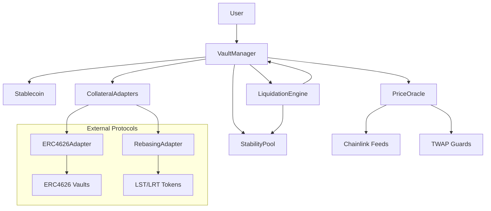
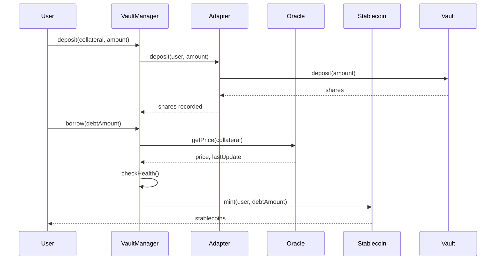
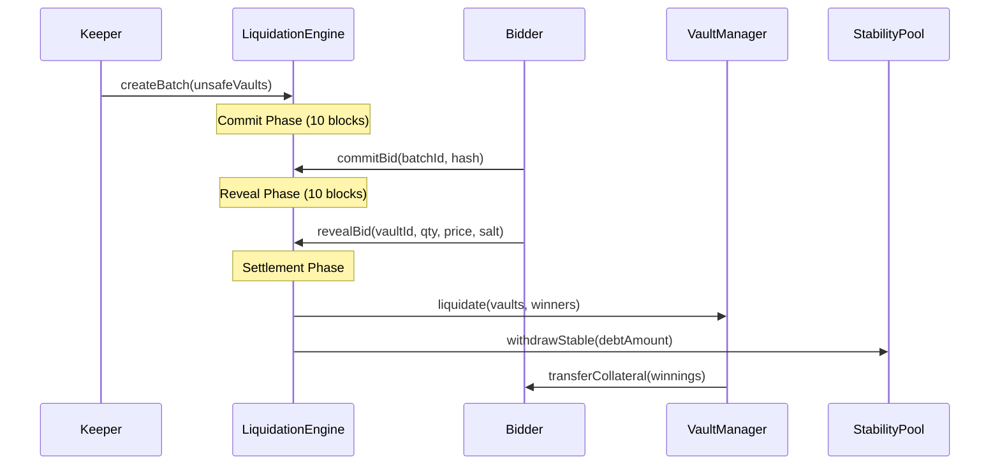
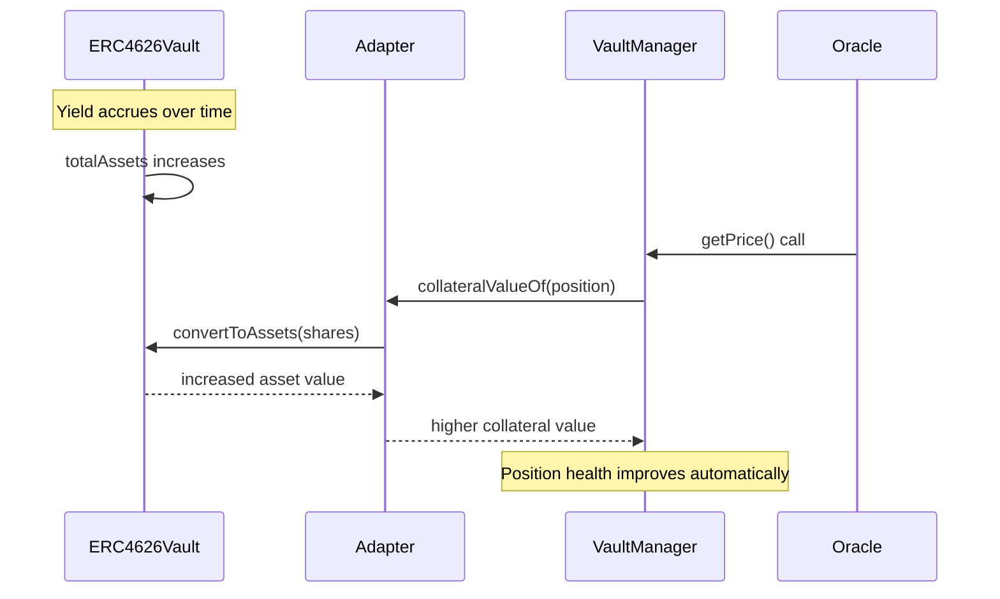

# Architecture - Stablecoin Lending Protocol

## System Overview

The protocol is a yield-bearing stablecoin lending system that supports ERC4626 vault adapters and rebasing tokens as collateral. It features MEV-resistant liquidations through commit-reveal batch auctions and modular components for extensibility.

## Core Design Principles

1. **Modular Architecture**: Separate concerns through adapter patterns
2. **MEV Resistance**: Commit-reveal auctions prevent front-running
3. **Yield Optimization**: Auto-compounding collateral improves health
4. **Security First**: Multiple defense layers and circuit breakers
5. **Gas Efficiency**: Optimized for reasonable transaction costs

## Module Architecture

```
┌─────────────────────────────────────────────────────────────┐
│                     Protocol Overview                        │
├─────────────────┬─────────────────┬─────────────────────────┤
│   Stablecoin    │   VaultManager  │    LiquidationEngine    │
│   (ERC20)       │   (Core Logic)  │   (Commit-Reveal)       │
├─────────────────┼─────────────────┼─────────────────────────┤
│  StabilityPool  │   PriceOracle   │    Collateral Adapters  │
│  (Liquidations) │   (Price Feeds) │   (ERC4626 + Rebasing)  │
└─────────────────┴─────────────────┴─────────────────────────┘
```

### Module Relationships



## Data Flow Diagrams

### 1. Deposit & Borrow Flow



### 2. Liquidation Flow



### 3. Yield Improvement Flow



## Component Details

### 1. VaultManager (Core Logic)

**Responsibilities:**
- Position management (open, close, modify)
- Health ratio calculations  
- Collateral and debt accounting
- Integration with all other modules

**Key Data Structures:**
```solidity
struct Position {
    uint256 collateralAmount;    // Adapter-specific units (shares)
    uint256 debtAmount;          // Stablecoin debt
    address collateralType;      // Adapter contract address
    uint256 lastUpdate;          // Timestamp of last modification
}

struct CollateralConfig {
    uint256 minCollateralRatio;  // MCR (e.g., 150%)
    uint256 liquidationFeeRate; // LFR (e.g., 10%)
    uint256 debtCeiling;        // Max debt for this collateral
    uint256 maxLTV;             // Max loan-to-value ratio
    bool enabled;               // Active/inactive flag
}
```

**Critical Functions:**
- `deposit()` - Add collateral through adapters
- `withdraw()` - Remove collateral with health checks  
- `borrow()` - Mint stablecoins against collateral
- `repay()` - Burn stablecoins to reduce debt
- `liquidate()` - Process liquidation settlements

### 2. Collateral Adapters

**Architecture Pattern:**
```solidity
interface ICollateralAdapter {
    function deposit(address user, uint256 amount) external returns (uint256 shares);
    function withdraw(address user, uint256 shares) external returns (uint256 amount);
    function collateralValueOf(address user) external view returns (uint256 value);
    function totalCollateral(address user) external view returns (uint256 amount);
}
```

#### ERC4626Adapter
- **Purpose**: Support auto-compounding yield vaults
- **Mechanism**: Converts deposits to vault shares, yield automatically improves health
- **Examples**: Aave aTokens, Compound cTokens, Yearn vaults

#### RebasingAdapter  
- **Purpose**: Support rebasing tokens (LSTs/LRTs)
- **Mechanism**: Normalizes rebases through share-based accounting
- **Examples**: stETH, rETH, frxETH

### 3. PriceOracle System

**Architecture:**
```solidity
contract GuardedOracle {
    mapping(address => PriceFeed) public feeds;
    mapping(address => TWAPConfig) public twapConfigs;
    
    struct PriceFeed {
        address chainlinkFeed;
        uint256 staleness;
        uint256 minPrice;
        uint256 maxPrice;
    }
}
```

**Protection Layers:**
1. **Staleness Checks**: Reject old prices (>1 hour)
2. **Sanity Bounds**: ±20% deviation limits  
3. **TWAP Guards**: 30-minute time-weighted averages
4. **Circuit Breakers**: Pause on extreme volatility
5. **Multiple Sources**: Primary + backup price feeds

### 4. StabilityPool

**Purpose**: Provide liquidity for liquidations
**Mechanism**: Users deposit stablecoins, earn fees from liquidations

```solidity
struct StabilityDeposit {
    uint256 amount;          // Deposited stablecoins
    uint256 rewardSnapshot;  // For reward calculations
    uint256 depositTime;     // For time-based rewards
}
```

### 5. LiquidationEngine Implementation

**Commit-Reveal Architecture:**
```solidity
struct Batch {
    uint256[] vaultIds;           // Vaults to liquidate
    uint256 commitDeadline;       // End of commit phase
    uint256 revealDeadline;       // End of reveal phase
    BatchStatus status;           // COMMITTING, REVEALING, SETTLING, COMPLETE
}

struct Bid {
    address bidder;
    uint256 vaultId;
    uint256 quantity;             // Amount of collateral desired
    uint256 price;                // Price per unit
    bool revealed;
}
```

## Security Architecture

### Defense Layers

1. **Access Control**
   - OpenZeppelin Ownable2Step for admin functions
   - Role-based permissions for different operations
   - Multi-sig requirements for critical parameters

2. **Reentrancy Protection**
   - ReentrancyGuard on all external functions
   - Checks-Effects-Interactions pattern
   - State validation after external calls

3. **Oracle Security**
   - Multiple price feed sources
   - Time-weighted averages
   - Deviation bounds and staleness checks
   - Emergency pause mechanisms

4. **Economic Security**
   - Conservative collateral ratios
   - Liquidation incentives aligned
   - Circuit breakers for extreme events
   - Gradual parameter changes

### Gas Optimization Strategies

1. **Storage Optimization**
   - Packed structs to minimize storage slots
   - Immutable configuration variables
   - Efficient mapping structures

2. **Computation Optimization**
   - Unchecked math where safe
   - Batch operations for multiple actions
   - View function optimization for external calls

3. **External Call Optimization**
   - Minimize external calls in hot paths
   - Batch oracle price requests
   - Efficient adapter interfaces

## Integration Patterns

### Adding New Collateral Types

1. **Create Adapter**: Implement `ICollateralAdapter`
2. **Price Feed**: Configure oracle for new asset
3. **Risk Parameters**: Set MCR, LFR, debt ceiling
4. **Testing**: Comprehensive test suite
5. **Governance**: Proposal to whitelist new collateral

### Extending Liquidation Mechanisms

```solidity
interface ILiquidationModule {
    function triggerLiquidation(uint256[] calldata vaultIds) external;
    function settleAuction(uint256 auctionId) external;
    function getAuctionStatus(uint256 auctionId) external view returns (Status);
}
```

## Performance Characteristics

### Gas Costs (Estimated)
- `deposit()`: ~150k gas (including ERC4626 vault interaction)
- `borrow()`: ~100k gas (including oracle calls)
- `liquidation commit`: ~80k gas
- `liquidation reveal`: ~60k gas
- `liquidation settlement`: ~200k gas per vault

### Scalability Limits
- **Concurrent Positions**: ~10k active positions per collateral type
- **Liquidation Batch Size**: 50 vaults per batch (gas limit constraint)
- **Oracle Updates**: 1-hour maximum staleness
- **Governance Changes**: 24-48 hour time delays

## Future Extensions

### Layer 2 Deployment
- Cross-chain price oracle synchronization
- L1 settlement with L2 execution
- Bridge security considerations

### Advanced Features
- **Multi-collateral positions**: Single position with multiple collateral types
- **Leverage farming**: Automated leverage strategies
- **Cross-protocol integrations**: DeFi composability
- **Governance token**: Protocol ownership and fee distribution

### Optimization Opportunities
- **Batch operations**: Multi-action transactions
- **Gas subsidies**: Meta-transactions for users
- **Oracle aggregation**: More efficient price updates
- **Storage proofs**: Reduce on-chain storage requirements

## Deployment Architecture

### Contract Deployment Order
1. Libraries (`WadMath`, utilities)
2. `Stablecoin` (standalone ERC20)
3. `PriceOracle` and price feeds
4. Collateral adapters (`ERC4626Adapter`, `RebasingAdapter`)
5. `StabilityPool` 
6. `VaultManager` (with all dependencies)
7. `LiquidationEngine` (MEV-resistant auctions)

### Configuration Setup
1. Set oracle price feeds for each collateral
2. Configure risk parameters (MCR, LFR, debt ceilings)
3. Whitelist collateral adapters
4. Set up governance multi-sig
5. Initialize emergency pause mechanisms

### Monitoring Setup
- Position health monitoring
- Oracle price deviation alerts
- Unusual liquidation pattern detection
- Gas price monitoring for keeper operations

## Conclusion

The modular architecture enables secure, efficient, and extensible lending operations while maintaining MEV resistance through sophisticated liquidation mechanisms. The adapter pattern allows for diverse collateral types while maintaining consistent interfaces and security properties.

The system is designed for progressive decentralization, starting with conservative parameters and multi-sig governance, then transitioning to full DAO governance as the protocol matures and demonstrates stability.